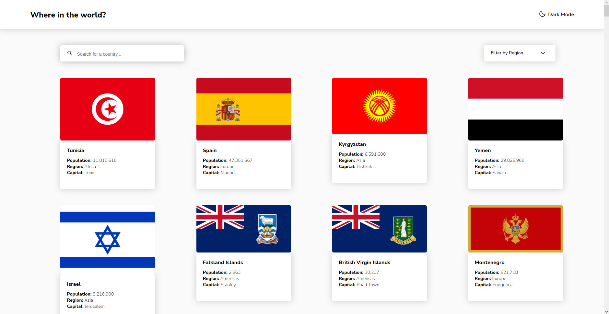
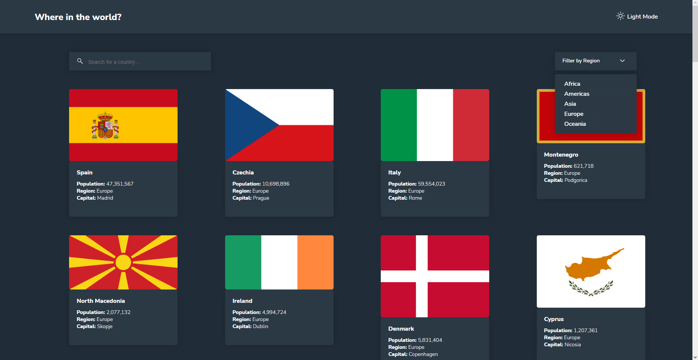
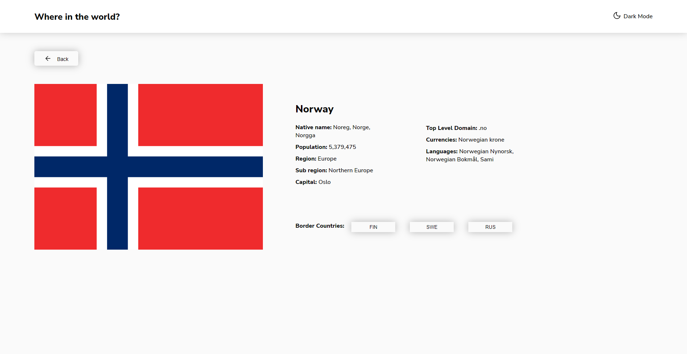
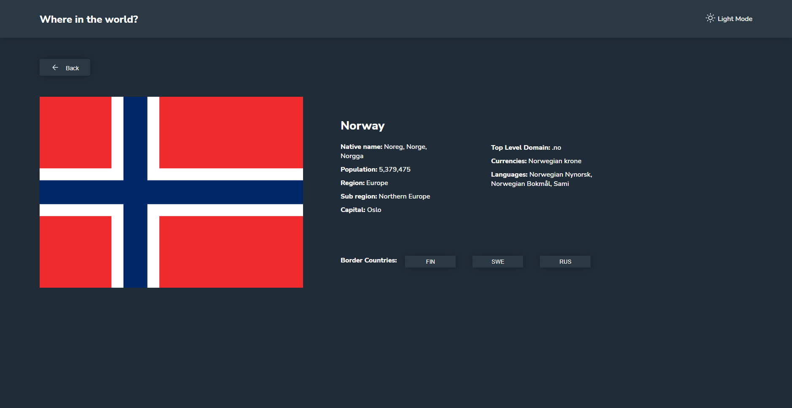

<h1 align="center">Rest Countries Api App🗺️🌐</h1>

<h4 align="center">
    This project is a challenge that I took from <a href="https://www.frontendmentor.io/challenges/rest-countries-api-with-color-theme-switcher-5cacc469fec04111f7b848ca">frontendmentor.io </a> which consists of building a page where you can find infos about many countries around the world  and get it looking as close to the design as possible.
</h4>

 

<h4 align = "center">
    <a align="center" href="https://www.frontendmentor.io/challenges/space-tourism-multipage-website-gRWj1URZ3/hub/responsive-multipage-website-created-with-html-sass-js-5OgOGVz5Y7">Front-end mentor challenge.</a> //
     <a align="center" href="https://gustavojuvino.github.io/Rest-Countries-Api/">Rest Countries Website App.</a>
</h4>

 

<h6 align="center"> This project was created with:</h6>
 
 

  
  
  
 

  

<!-- Desktop -->
<h2 align="center">Desktop Version 🖥️</h2>

<!--Made By Gustavo J. Souza -->
